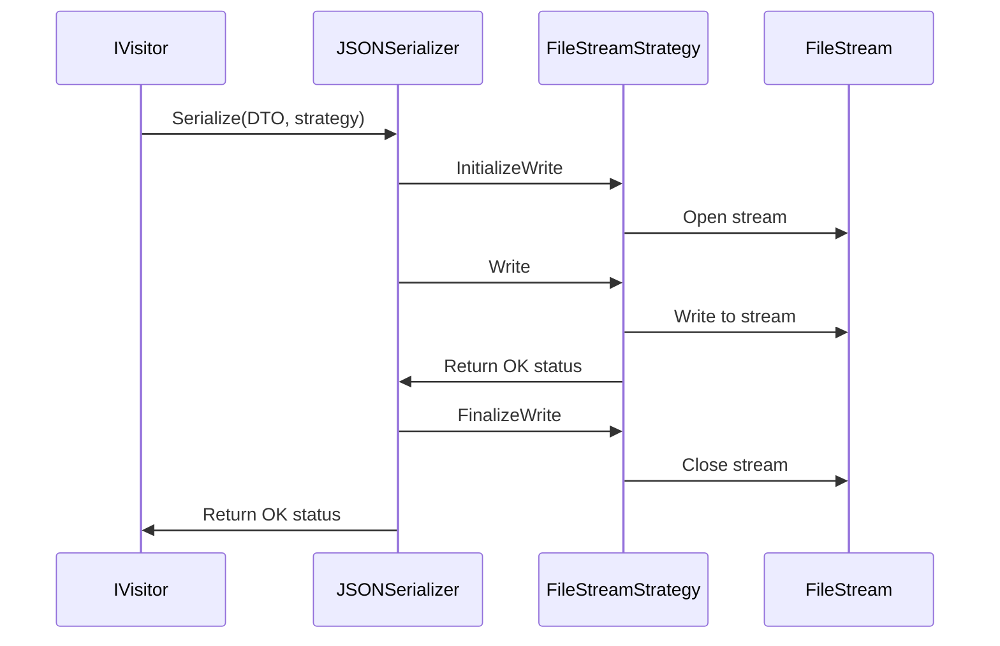

# [Work in progress]

---

# Saving and loading stuff

## TL;DR

- First, we use the visitor pattern to convert an object-oriented class instance into a DTO (Data Transfer Object) - an anemic data-only structure that stores the state of the class instance
- Then, we save the DTO into a file of our choice using the serializer
- We can use DTOs not only to save and load data but also to clone objects
- Visitors allow us to perform deep copying of serializable classes as long as those classes implement the ISerializable interface and the composite visitor used in the process contains a concrete visitor for each of the variable types being visited

## Notes

- Any serializable class should always be able to save its state into a DTO and load the state from it. Class instances that are deserialized from the same DTO should behave the same way as the instance that was serialized into the DTO. Consider the DTO a RAM version of a save file
- The file type should NOT describe the structure of the DTO. The DTO's variables and their types are defined by the business logic and marshalling, not the output file type. That's why, for instance, a DTO that stores a player's HP, money, ammo, and inventory can be saved into a JSON, a YAML, a CSV, a protobuf, or sent as a plain string to any service of the user's choice and parsed back into the same DTO (at least in most cases)
- Serializers use the strategy pattern to perform serialization-specific logic that differs between the media. For instance, the same XML file can be saved as plain text, streamed, packed into an HTTP request body, encrypted, etc. The serialization argument provided to the serializer describes the media and its settings (i.e., path to the save file on the drive) so that the serializer can use the respective strategy to perform serialization

## Implementations

- JSON serializer uses Newtonsoft JSON.Net
- YAML serializer uses YamlDotNet
- Protobuf serializer uses protobuf-net
- CSV serializer uses CsvHelper

## Example

In this diagram, a DTO is converted to a JSON file and streamed to disk.

