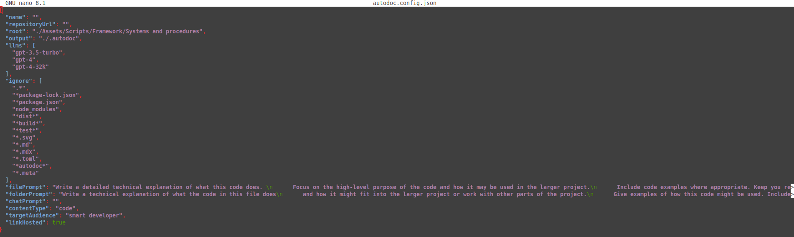
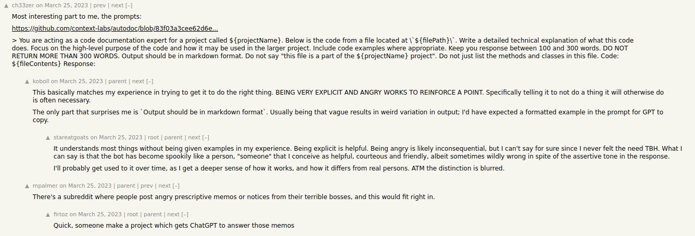
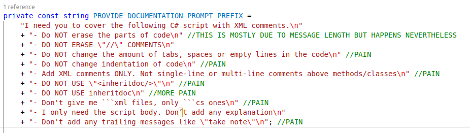
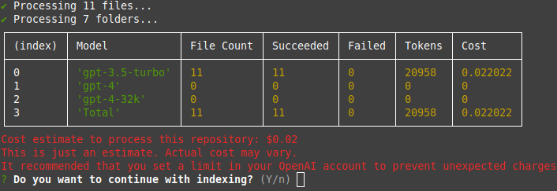
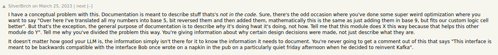
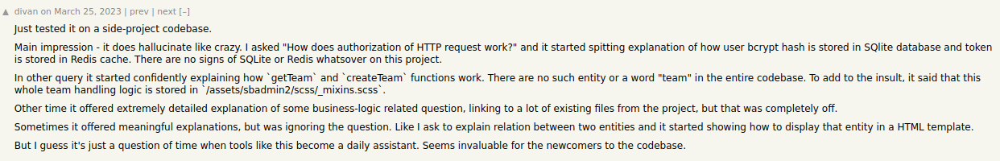

# Do not use autodoc

Lately I was discussing with fellow developers the ways to create and maintain the project documentation without allocating a lot of time to it. The idea that was crossing my mind on multiple occasions (including the discussion we had) for the last year or two is to have a tool that would generate the documentation automatically from the codebase.

I've already created a tool like that for one of the Unity projects I had, but it was not perfect. I was not happy with the prompts I've written, I was not happy that the code I received from the response had to be sanitized (it had to be in cs and not XML for example, it had to be stripped of all the \`\`\`, etc.), I was not happy with async code I've written, it had no tokenization capabilities to trim requests, some requests had to be done multiple times to receive a proper quality code, etc.

The other time I was thinking about this, Copilot had received an update that allowed to perform chat queries based on the codebase. Unfortunately, it was not in a proper state to satisfy my request - the files it was chosing in the codebase were totally random, and the code it was generating was not always correct. I don't know whether the situation has changed since then, but I was not happy with the results I was getting.

While investigating the options the other day, I stumbled upon the autodoc project (<https://github.com/context-labs/autodoc>). After spending the whole day trying to make it work, I realized that it is not the right tool for the job. Here is why.

## Node.js

First of all, as autodoc is a Node.js package, it obviously requires Node.js, but not just any version of it. The documentation on the github page states `Autodoc requires Node v18.0.0 or greater. v19.0.0 or greater is recommended.`. I won't go into great details regarding upgrading Node.js from version 10 to 19 by first trying to reinstall it with apt-get (which actually lowered its version down to 6), then trying the options kindly offered by stackoverflow users and realising that between 10 and 19 Node.js has changed its `node_packages` folder and `packages-lock` file locations, the fact that to fix some errors all I had to do was **to close the terminal and open it again**, etc. Long story short, node was ultimately upgraded but the process was not really fun.

## GLIBC version

After upgrading Node.js, I've tried to install autodoc module. It has produced a lengthy error log which after some inspection yielded the reason the installation has failed: the installer could not locate `GLIBC` version `2.33`. This was not the first time I've had the unpleasure of dealing with GLIBC version issues - a year ago adding Firebase's SDK to the Unity project has produced the same error. I remember the struggles it took me back then - trying to update the library with `apt-get`, trying to install the more recent version from Ubuntu's repository, trying to download the RPM, trying to install with brew instead, setting symlinks to the versions obtained not from `apt-get`, etc. Nothing worked properly. The solution that actually worked was to wait until the default repository of the distributive I'm using updated their GLIBC version but that happened only half a year later.

I had no desire to wait for another year, so I've tried to look for opportunities to install node and npm on a windows machine. Among the installers that the official page has offered me I've noticed no simple `.msi` / `.exe` executables to download and run but I've noticed an option to install npm on a docker container instead. I thought "Why not?" and tried to install it. The installation was successful, but the `autodoc` module was not (again). This time the issue was that there was no python preinstalled in the docker container. To add insult to injury, the container image was based on Alpine distro instead of Debian or Ubuntu and therefore had no `apt` / `snap`. Even after following the instructions I've googled for installing python3 on Alpine the bash kept telling me that it has no idea what python or python3 is. This was the moment I decided to quit this approach and try something different.

I switched back to my linux machine, pulled the latest ubuntu image, ran the container, installed build-essentials, git, curl, python, node, npm and the rest of necessary dependencies. `ldd --version` has finally yielded `2.4` which I was happy about and tried to install `autodoc` package once again. This time the installation was successful, I could finally run the 'doc' command and proceed from installation/googling circle of hell to actually trying the tool out

## The tool itself

After a couple of tries I've realised that I cannot invoke the tool at random places in codebase because the tool keeps looking for `autodoc.config.json` at the current folder. Luckily, the root folder could be changed in the aforementioned config file. It also contains the fields for project name and github page variables filled out during  the 'doc init' stage (what are those even used for?), an array of gpt versions you can run your prompts on and prompt prefixes themselves

As it turned out, **autodoc is not so different from the tool I've created** - it basically takes the piece of source code file, injects it into the prompt after the prefix and sends it to the GPT model of your choice. Folks on ycombinator were just as amused at the prompts autodoc uses as I was about the ones I was refining while creating my own tool:

(*Just to give you some context, here's the prompt prefix I ended up with for my own tool after some trials and errors*)

While running the autodoc I've noticed one huge advantage it has over the tool I've created (at least in its current state) - it performs tokenisation and provides you with the cost of the prompt.

Unfortunately, this is the **only** advantage it has. First, running the tool gave me literally nothing as the output was riddled with errors and red texts. As it turned out, those errors had **nothing to do** with what was the actual issue: all of the responds had 'Too many requests' error in their body, as figured by the person in this thread: (<https://github.com/context-labs/autodoc/issues/5>)

The source of `Too many requests` error was discovered in the separate thread: (<https://github.com/context-labs/autodoc/issues/6>). The solution was **to modify the .js source code file** of the package (`APIRateLimit.js`) to lower the amount of `maxConcurrentCalls` to 1. Long story short: **it didn't work**, to make it actually stop spamming gpt with prompts you should also add **a manual 1-second timeout** between each call. The participants noted that the variable should be added to the configuration file to be able to be tweaked manually but more than 1.5 years later, it is still not implemented and the bug is still present

## The results

Alright, after all the hustle I've finally managed to run the tool without any mistakes at the cost of ~25 cents. The results? **NOTHING**. Not a single method in any single cs file was prepended with fresh XML comments (like my tool does)band the **only** file added to the git commit was the cursed `autodoc.config.json`. As folks on ycombinator have noted, `The only part that surprises me is "Output should be in markdown format"`. This was the moment I realized that the tool was not even close to what I was looking for. I can create a documentation from existing codebase (preferably with XML comments) with either `DocFx` or `Doxygen`, why would I need yet another `md`/`html` file generator? I needed a tool to create said XML comments in the first place without the developers spending their time typing them manually or demanding from them to use paid third party tool (`Copilot`) that would *somewhat* ease the process yet still require attention because LLMs do not provide reliable results even with a context. I do not feel like improving `autodoc` at all as it (imo) does a lot of things wrong from the get go - it's a node package composed of js and ts scripts instead of an application that could be run with a cli command, it does not await for prompt responses before sending the next ones or doing at least any request scheduling to not accidentially flood GPT with prompts (like my tool does), it's not modifying the code files with results, the 'output in the markdown format' is nowhere to be found, it has no proper capabilities to specify which folders to process or filter files except that 'ignore' field in the config file that would get ugly very soon if you use it for this purpose, it's awful at CI/CD integration as it requires specific version of a library that is not present on every linux distro (and is really dangerous to replace as some people pointed out) and a lot of additional manual steps to be done, etc.

## Conclusion

I've spent the whole day trying to make the tool work and the results are not satisfying. It's not saving any time nor provides any meaningful result for the amount of time it takes to set up, adjust, patch and use. Another thing to note is the relevant comments I've discovered on this thread (<https://news.ycombinator.com/item?id=35297766>):

